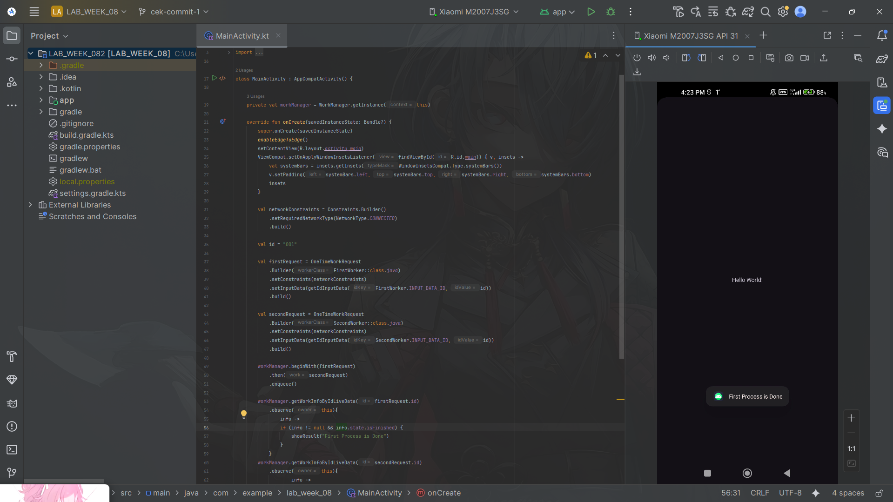
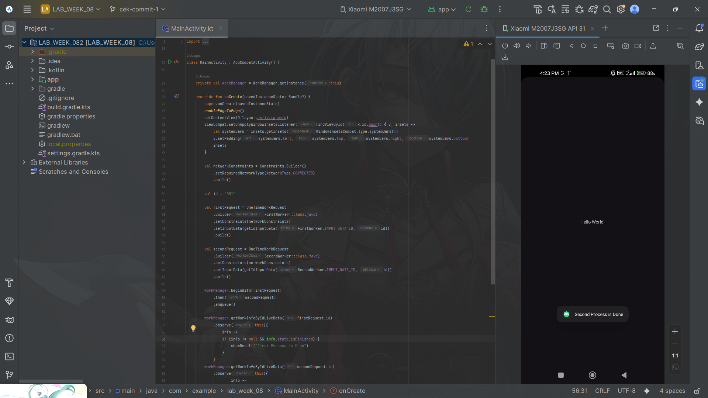
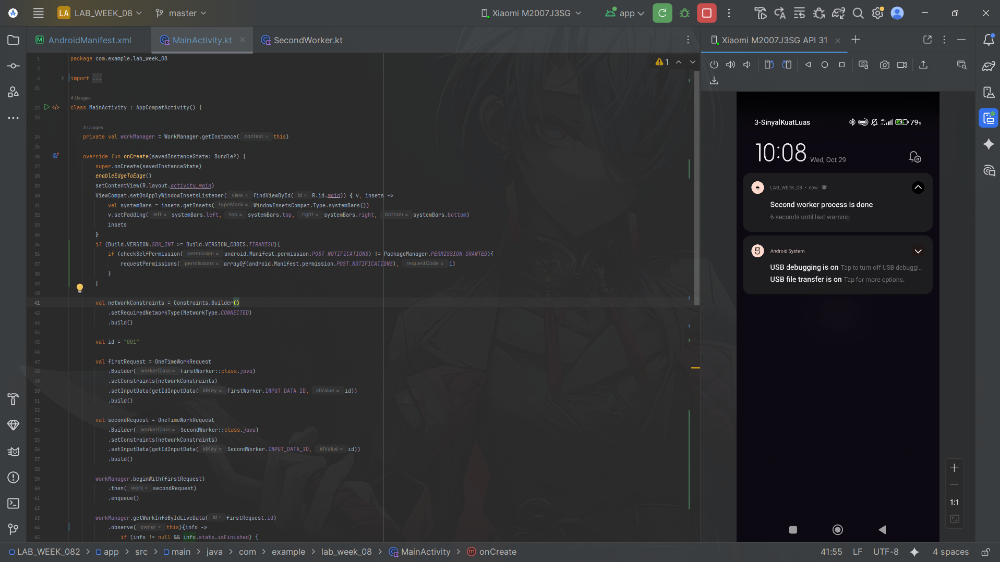
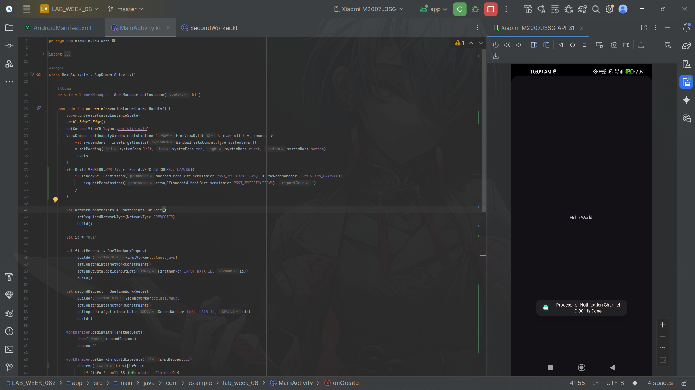
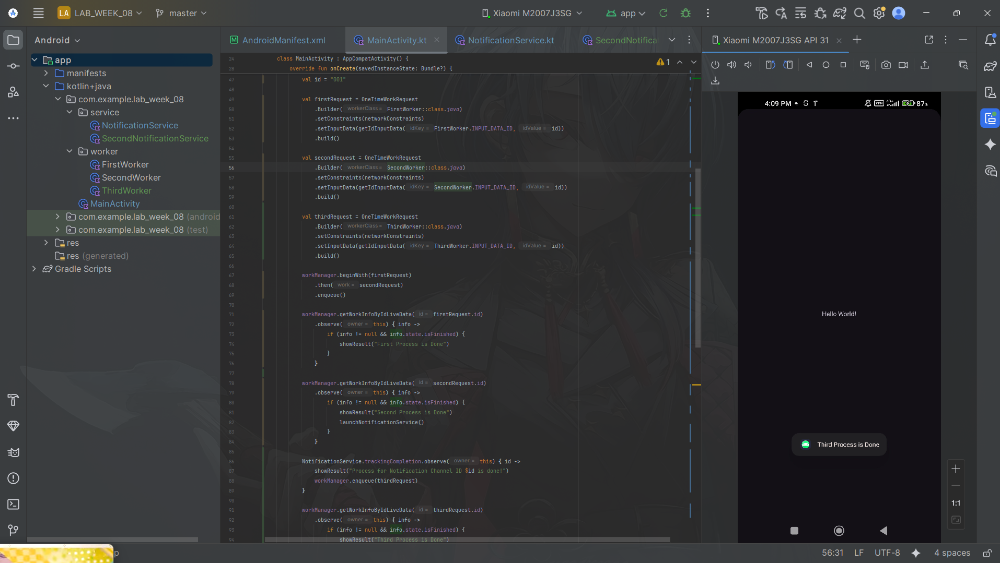
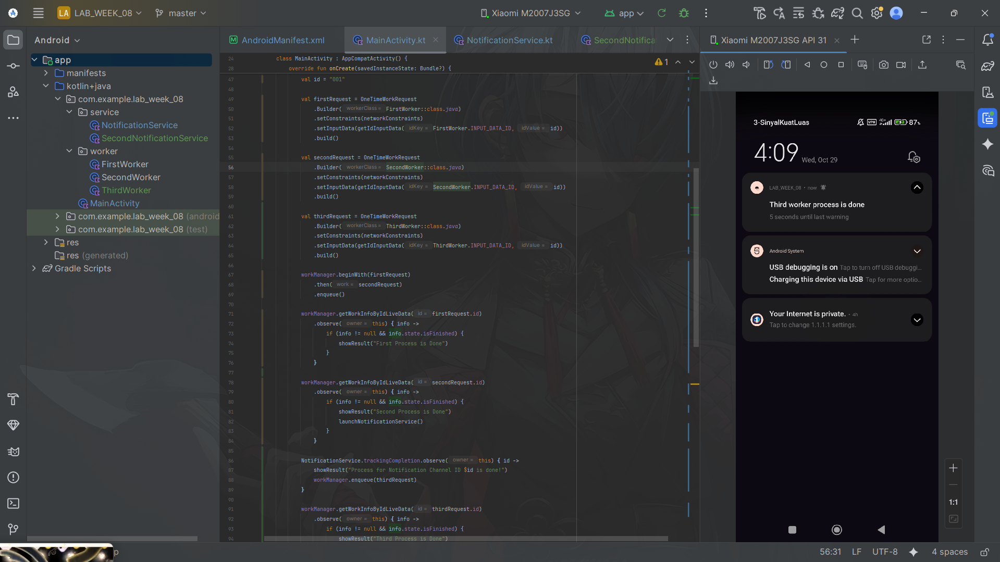
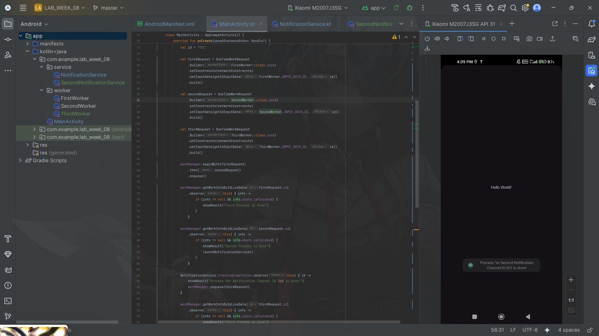

### Submitted by:
* **Nama:** Fernando Sunarto
* **NIM:** 00000083441
* **Class:** AL
---

### Project Files
| Commit | Description | APK Download | Screenshot Preview |
| :---: |---------------------------------------------|:---:|:---:|
| **01** | **First Worker Toast** | [📱 Download APK](Apps/Commit1.apk) | |
| **01** | **Second Worker Toast** | [📱 Download APK](Apps/Commit1.apk) | |
| **02** | **Notification For Second Worker** | [📱 Download APK](Apps/Commit2.apk) | |
| **02** | **Process Done Notification Toast** | [📱 Download APK](Apps/Commit2.apk) | |
| **03** | **Third Worker Toast** | [📱 Download APK](Apps/Commit3.apk) | |
| **03** | **Notification For Third Worker** | [📱 Download APK](Apps/Commit3.apk) | |
| **03** | **Process Done Second Notification Toast** | [📱 Download APK](Apps/Commit3.apk) | |

### Code that Changed for Assignment
1. **Add Some Files (For Third Worker And Second Notification its like 95% Similiar Code with before)**:
   ```diff
   + SecondNotificationService
   + ThirdWorker
   ```

2. **Modify AndroidManifest.xml**:
   ```diff
   + <service
   +        android:name=".service.SecondNotificationService"
   +        android:enabled="true"
   +        android:exported="false"
   +        android:foregroundServiceType="dataSync"/>
   ```
3. **Modify MainActivity.kt**:
   ```diff
   + val thirdRequest = OneTimeWorkRequest
   +           .Builder(ThirdWorker::class.java)
   +           .setConstraints(networkConstraints)
   +           .setInputData(getIdInputData(ThirdWorker.INPUT_DATA_ID, id))
   +           .build()

   + private fun launchSecondNotificationService(){
   +       val serviceIntent = Intent(this,
   +            SecondNotificationService::class.java
   +        ).apply{
   +           putExtra(EXTRA_ID, "002")
   +        }

   +        ContextCompat.startForegroundService(this,serviceIntent)
   +     }
   ```

   Notes: I change place for this codes from launchNotificationService
    ```diff
   - NotificationService.trackingCompletion.observe(this){
   -       id ->
   -        showResult("Process for Notification Channel ID $id is Done!")
   -    }
    ```
   To the function on create near the workmanager
   
